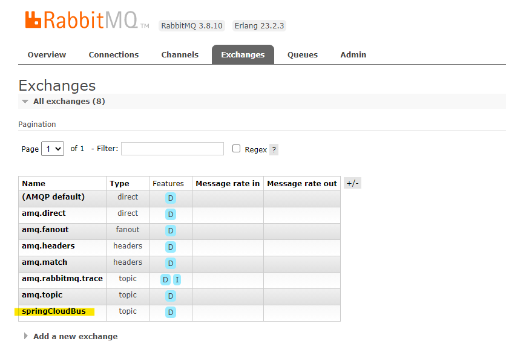
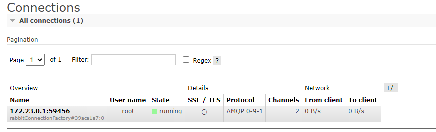

# springboot-cloud-config-client

# 경험기
## 의존성 관리
* `implementation 'org.springframework.boot:spring-boot-starter-actuator'`
* `implementation 'org.springframework.cloud:spring-cloud-starter-config'`
* `implementation 'org.springframework.cloud:spring-cloud-starter-web'`

세 개만 최소한으로 일단 구성되어 있으면 작동하는데 큰 문제는 없음. web 어 없을 시, 임베디드 톰캣이 없기 때문에 실행하자마자 프로세스가 종료된다.

## actuator 의 POST /actuator/refresh 
* 위의 url 수행 시, repo 수정된 내용이 애플리케이션에서도 갱신되어 리턴된다. 
* http status 는 `200` 으로 떨어진다.

## spring cloud bus
* spring config client 의 개수가 많을 경우, 일일히 /actuator/refresh 를 수행해주어야 한다. 하지만 이를 극복하기 위해서 `cloud bus` 가 도입되었다.
* 의존성을 추가한다. `implementation 'org.springframework.cloud:spring-cloud-starter-bus-amqp'`
    * 해당 의존성이 추가되면 `@RefreshScope` 이 없는 레이어계층의 `@Value` 는 spring config repo 값을 획득하지 못하는 것로 보인다. 
* rabbitmq 를 이용하여 단 한번의 /actuator/refresh 를 통해 나머지 spring config client 에게도 repository 변경사항이 갱신될 수 있도록 한다.
* [docker-compose.yml](../docker/rabbitmq/docker-compose.yml) 을 이용하여 rabbitmq 컨테이너를 띄운다.
    * id : root
    * pw : rootpass
* spring cloud client 는 rabbitmq 와 연동되고, `POST /actuator/bus-refresh` 를 통하여 일일히 모든 client 들에게 갱신요청을 할 필요가 없다. 

## rabbitmq 와 연결된 spring config client (rabbitmq 는 컨테이너로 올라와있다.)
### rabbitmq exchanges 정보

    

### rabbitmq connections 정보

    

 
